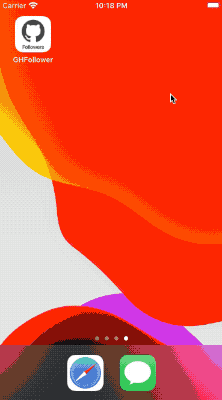
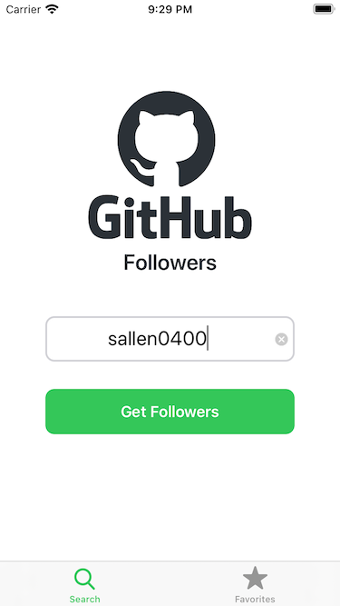
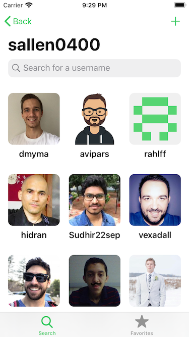
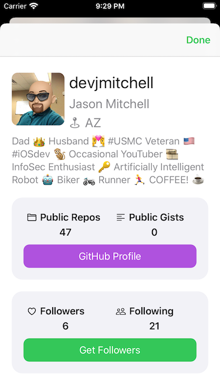
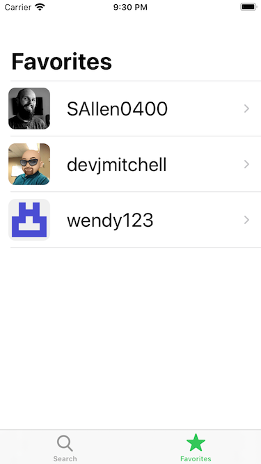
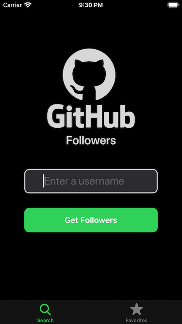
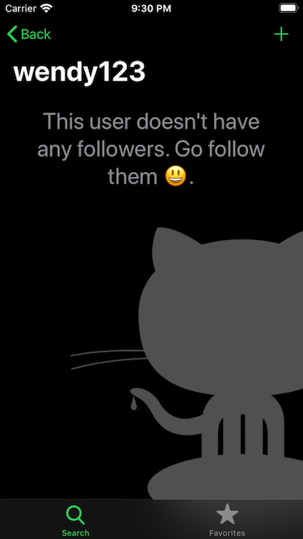
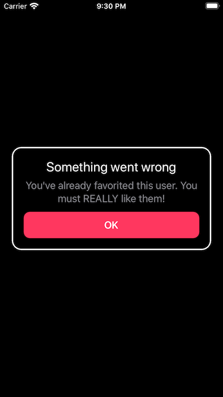

# GitHubFollowers

An iPhone App to checkout a GitHub users follower list and checking them out. It has the most important features like 
accessing an API, multiple screens implemented using MVC, autolayout based UI (implemented programmatically), use of 
`UICollectionView`, `UITableView` and various custom subviews.

Based on the "Take Home Project" course taught by [@SAllen0400](https://github.com/SAllen0400) at [teachable.com](https://seanallen.teachable.com/p/take-home).

Everything up to the [Final tag](https://github.com/pd95/GitHubFollowers/releases/tag/Final) was based on Sean Allens course.

## Branches

The [branch course-branch](https://github.com/pd95/GitHubFollowers/tree/course-branch) will be used to follow further 
enhancements/corrections based on Seans course. Other adaptions on master and branches are based on my other iOS findings 
and learnings.

The [refactor-use-storyboard branch](https://github.com/pd95/GitHubFollowers/tree/refactor-use-storyboard) illustrates how I 
adapted the course code back to a storyboard based solution. All the lessons related to autolayout constraints can also be used 
in the WYSIWYG storyboard world.

On the [master branch](https://github.com/pd95/GitHubFollowers/tree/master) I've additionally implemented dynamic text support 
and removed height/width constraints on text based elements to support the iPhone SE (1st Generation).
The "in code" implemented views and view controllers pose a bigger problem and would need to be replaced with storyboard implementations for better results.

The [rewrite-using-swiftui branch](https://github.com/pd95/GitHubFollowers/tree/rewrite-using-swiftui) illustrates how I rewrote
the code using SwiftUI. As SwiftUI has a different approach to UI and views, a lot of code had been thrown away and the 
view code does not resemble at all  to what existed before, but I kept the basic file separations. To be honest, if I would write the 
app from scratch, the separation would look differently. 

## Screenshots

